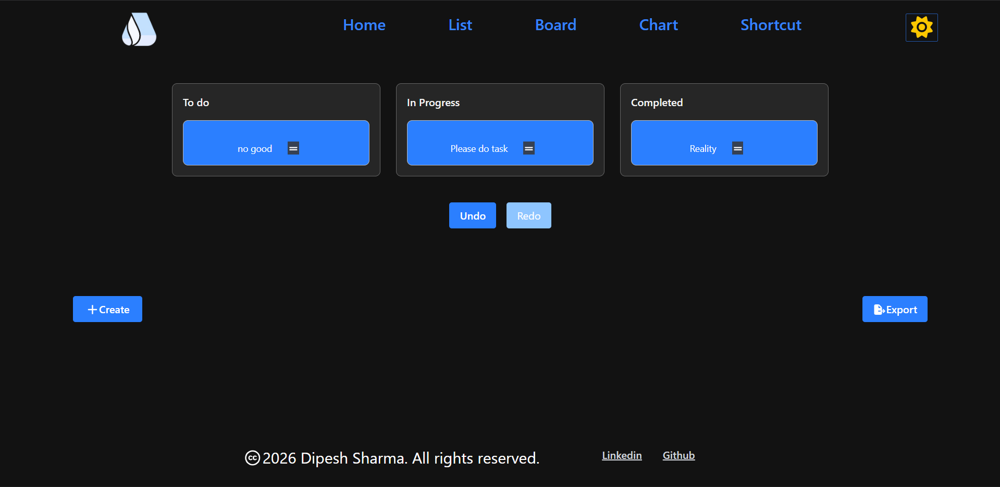
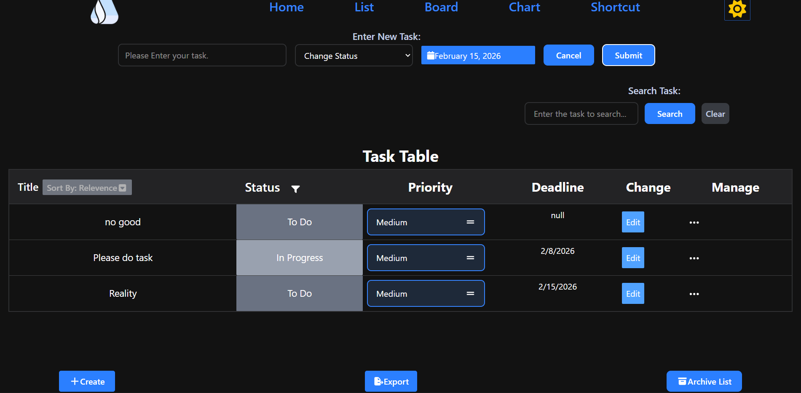
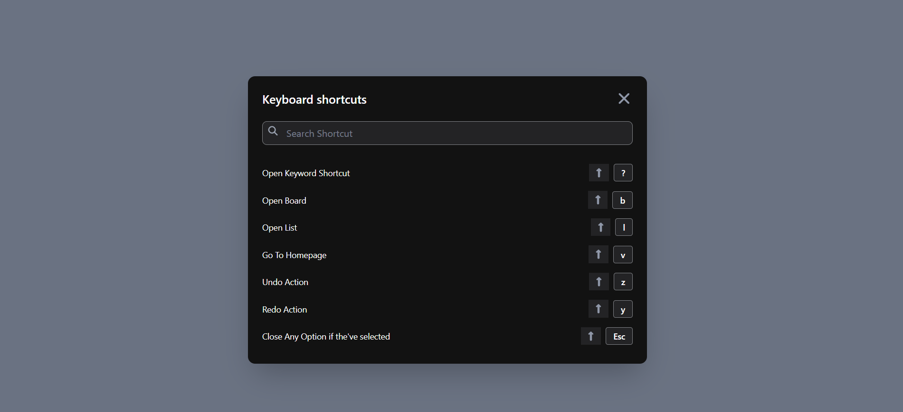
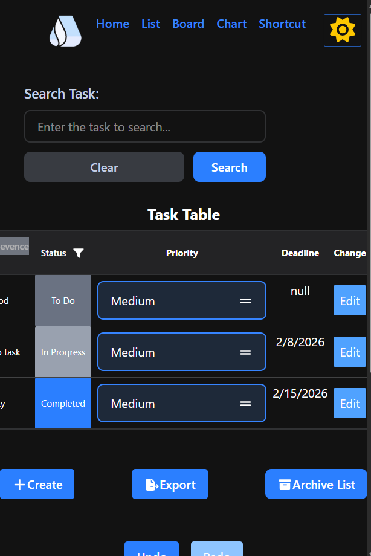

# StateFlow — Project Management

A Jira-like project management app built with React and TailwindCSS, featuring drag-and-drop boards, undo/redo, keyboard shortcuts, dark/light mode, and full data export.

<div align="center">


**🗓️ Started:** January 8, 2026 &nbsp;|&nbsp; **✅ Completed:** January 21, 2026 &nbsp;|&nbsp; **👨‍💻 Type:** Beginner Frontend Project &nbsp;|&nbsp; **🚀 Deployed on:** Vercel

</div>

---

## Table of Contents

1. [Overview](#overview)
2. [Screenshots](#screenshots)
3. [Tech Stack](#tech-stack)
4. [Features](#features)
5. [Libraries Used](#libraries-used)
6. [Drag and Drop](#drag-and-drop)
7. [Context API](#context-api)
8. [Undo / Redo Logic](#undo--redo-logic)
9. [Portal](#portal)
10. [Things Learned](#things-learned)
11. [Issues Fixed](#issues-fixed)
12. [Responsive Design](#responsive-design)
13. [Post Maintenance](#post-maintenance)
14. [My Reusable Styles](#my-reusable-styles)

---

## Overview

StateFlow is a beginner-level frontend project that mimics core Jira functionality. It supports task creation, editing, filtering, sorting, drag-and-drop board view, list view, undo/redo history, keyboard shortcuts, dark/light mode toggling, data export (JSON/CSV), archive management, and pinned tasks — all persisted via `localStorage`.

---

## Screenshots

<div align="center">






</div>

---

## Tech Stack

| Layer | Technology |
|-------|-----------|
| UI Framework | React |
| Styling | TailwindCSS |
| Routing | React Router |
| State Management | Context API |

---

## Features

### Task Management
- Create, edit, and cancel tasks via user input
- Show tasks on a table/grid layout
- Change task priority: Easy, Medium, Hard
- Add deadline date and time (optional)
- Add labels/tags using `react-select`
- Pin any task — shown on homepage with data persistence
- Write custom messages for new task inputs
- Archive tasks and manage them from the archive list

### Board & List View
- Drag-and-drop board view with live `localStorage` updates
- List view with sorting: Ascending, Descending, Default, Deadline, Priority, Status
- Empty state styling with centered `colspan`
- Ellipsis menu with delete option

### Undo / Redo
- Full undo/redo with a custom hook
- Based on three states: `past`, `present`, `future`

### Keyboard Shortcuts
- Full keyboard shortcut implementation
- Shortcut cheat-sheet page accessible via `Ctrl+?` or the header bar

### Data & Export
- Export all task data in JSON or CSV format
- Chart view with pie charts (homepage + separate chart page)

### UI & UX
- Dark/Light mode toggle (`tailwind.config.js` setup)
- Responsive design across all pages: homepage, chart, list, shortcut, header, and footer
- Website logo and footer page
- Loading state with React Router (lazy loading + `Suspense`)
- Error page with error details shown to the user
- Cancel button on the input field

### Performance
- Code splitting with `React.lazy()` and `Suspense`
- Vercel Analytics integration for visitor stats

---

## Libraries Used

| Library | Purpose |
|---------|---------|
| `tailwindcss` | Styling |
| `fontawesome` | Icons |
| `react-router` | Routing |
| `@dnd-kit/core` | Drag and drop |
| `react-date-picker` | Deadline date picker |
| `react-select` | Label/tag multi-select |
| `chart.js` | Chart rendering |
| `react-chartjs-2` | React wrapper for chart.js |
| `lodash` | Utilities (camelCase, startCase) |
| `react-loader-spinner` | Loading spinner |
| `vercel analytics` | Visitor stats |

---

## Drag and Drop

- Uses the `@dnd-kit/core` library, wrapping everything inside `DndContext`
- Uses the `closestCorners` algorithm to identify which item is being dragged

> ⚠️ `closestCorners` is used on `DndContext` to identify the drag target.

### Key Hooks
- `useDraggable` — attach to a draggable element with a unique `id`
- `useDroppable` — attach to a droppable zone; key properties:
  - `id` — the task's unique ID
  - `setNodeRef` — attach to the task's div
  - `listeners` — spread on the div (enables mouse/touch drag)
  - `attributes` — accessibility attributes
  - `transform` — makes it visually move while dragging

### Other Details
- `onDragEnd` is used to handle drop completion
- `{css}` utility from `@dnd-kit/utilities` is imported for transforms
- Sensors added to support keyboard shortcuts and mobile dragging

---

## Context API

- Create a `context/` folder inside `src/`
- Create a `createContext` from React, then wrap all content in `createContext.Provider`
- Pass shared values via the `value` prop on `<createContext.Provider value={[]}>`
- Access context anywhere with: `const [value] = useContext(dataContext)`
- `tasks` and `setTasks` are both wrapped and shared via Context API

---

## Undo / Redo Logic

Three states are maintained: `past`, `present`, and `future`.

| Action | Behavior |
|--------|----------|
| Undo | Takes the last value from `past`, moves `present` to `future`, sets new `present` |
| Redo | Takes the first value from `future`, moves `present` to `past`, sets new `present` |
| New action | Appends `present` to `past`, clears `future`, sets new `present` |

- `present` is a single value; `past` and `future` are arrays
- A custom hook was created to encapsulate this logic
- This was a first-time implementation — took multiple iterations and references to get right

---

## Portal

Used for popup/modal features in React.

- Popups nested inside a component can conflict with `z-index` and `position: absolute` of parent elements
- `createPortal` from `react-dom` solves this by rendering outside the component tree
- A new DOM element (e.g., `#portal`) is added beside `#root` in `index.html`
- The popup is returned via `createPortal(content, document.getElementById("portal"))`

---

## Things Learned

- `arr.slice(0, -1)` removes the last element and returns a new array
- `parseInt` converts a string to an integer
- Nullish coalescing: `val ?? 9` uses `9` only if `val` is `null` or `undefined`
- Direct JSX return: `export default () => ()` lets you write return JSX without curly braces
- `whitespace-nowrap` keeps text on a single line
- `startCase(camelCase(val))` from Lodash converts any value to Start Case
- `text-zinc-500` is a valid Tailwind color option
- Use `.find()` for a single match, `.filter()` for multiple matches

---

## Issues Fixed

- Default `<select>` option hiding/showing behavior
- Used `onSubmit` instead of `onClick` on a form — caused unexpected triggers
- Unable to track single row selection without selecting all rows — fixed
- Event delegation on parent elements not working — fixed
- Setting default input values in controlled components
- Click-outside detection to hide input
- `localStorage` hook causing duplicate entries on re-render due to spread operator misuse
- Duplicate entries resolved by checking array before inserting — update if exists
- Over-engineering on filter logic — simplified
- Confusing an object with an array when accessing `.` properties — fixed
- Header component incorrectly placed in render instead of inside the Router — fixed
- Many drag-and-drop bugs during initial implementation
- Naming and `toLowerCase()` errors when converting static data to `localStorage`
- Undo/redo `rest` operator returning incorrect last value — fixed after multiple attempts
- Used `redirect("/board")` incorrectly for keyboard shortcut navigation — fixed
- `if(e.ctrlKey == true)` is redundant; `e.ctrlKey` is already a boolean
- Missing index route for the homepage — added
- Ellipsis delete menu styling issue — fixed
- `updateResult` function not guaranteed to receive an array — added array check
- `colspan` not centering when list is empty — fixed
- Sort by relevance (returning to the previous state) — solved using a separate `displayAllTasks` temp variable
- CSV export not correctly separating object fields — fixed
- Array not spreading correctly, causing no line break — fixed

---

## Responsive Design

- Responsive layout added across: header, footer, homepage, chart, list, keyboard shortcut, and task sidebar
- Lodash `camelCase` used for value conversion
- Remaining issue: `flex-row` layout on the list chart on small screens is not fully resolved

---

## Post Maintenance

| Date | Fix |
|------|-----|
| 01/22 | Improved empty state styling on homepage; fixed `colspan` centering |
| 01/22 | Added cancel button for the input field |
| 01/22 | Fixed draggable scroll styling on empty table |
| 01/22 | Styled the label bar; added `isLabel` to input; auto-focus with `cursor: text` |
| 01/22 | Set `isPinned` to `false` by default; removed unnecessary props (using `useContext` instead) |
| 01/22 | Removed separate Pinned section from context bar |
| 01/22 | Styled error page; fixed create and export button styles |
| 01/22 | Implemented Archive feature |
| 01/23 | Added archive list view with delete; moved archive data to `localStorage` |
| 01/26 | Moved Pages to a separate folder; moved Common components out of Components; fixed all import/export errors |
| 01/26 | Improved footer page styling |
| Various | Fixed spelling and structural issues in `README.md` |

---

## My Reusable Styles

Reusable Tailwind class patterns I use across projects:

**Button:**
```
opacity-85 cursor-pointer bg-blue-500 font-semibold py-2 px-4 rounded m-2
```

**Input:**
```
bg-transparent h-10 w-72 rounded-lg text-black placeholder-transparent ring-2 px-2 ring-gray-500 focus:ring-sky-600 focus:outline-none
```

> 💡 Use `space-4` on a parent instead of `gap-4` on child elements where applicable.

---

> ⚠️ **Infinite re-render warning:** In React, infinite re-renders are usually caused by missing dependency arrays in `useEffect`, or by calling a state setter directly in the render cycle. Always add a dependency array to stop unnecessary re-renders.